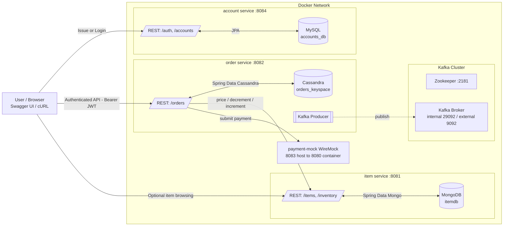
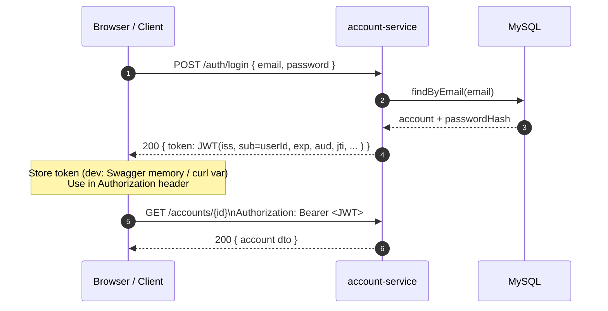
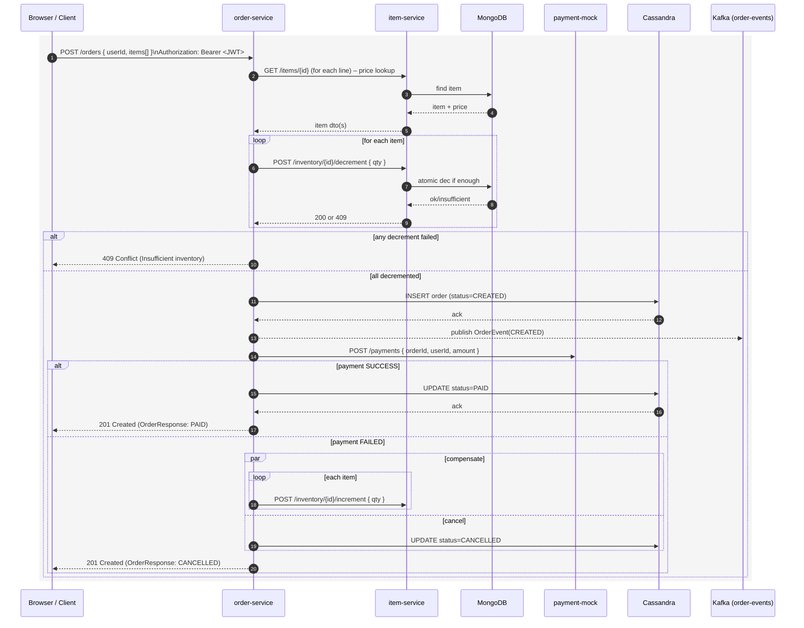

# Online Shopping System – Architecture, User Flow & Data Flow (Final)

This document summarizes the final design of the three-service project and shows how users and data move through the system.

## Stack Overview

* **Services**: `account-service` (JWT auth, MySQL), `order-service` (orders, Kafka events, Cassandra), `item-service` (catalog & inventory, MongoDB), `payment-mock` (WireMock).
* **Infra**: Kafka + Zookeeper, Cassandra, MySQL, MongoDB (all via Docker).
* **Security**: JWT (HS256 in dev), `Authorization: Bearer <token>` between client → services.
* **Ports (host → container)**: account **8084→8084**, order **8082→8082**, item **8081→8081**, payment-mock **8083→8080**, MySQL **3307→3306**, MongoDB **27018→27017**, Cassandra **9042→9042**, Kafka **9092 (external)**/**29092 (internal)**, ZK **2181**.

---

## 1) Architecture (Containers & Dependencies)



**Notes**

* `order-service` requires a valid **JWT** (issued by `account-service`) for its endpoints.
* `item-service` is called by `order-service` for pricing and inventory mutation.
* Payment is mocked by WireMock; success/failure is controlled by stub rules.
* `order-service` also publishes `order-events` to Kafka for downstream consumers (future).

---

## 2) User Flow – Login & Authenticated Read



**Key points**

* JWT is signed by `account-service`. In prod, use HTTPS and consider RS256 + JWKS.
* Token include claims such as `iss`, `sub` (userId), `exp`, and optionally `aud`, `jti`, `ver`.

---

## 3) User Flow – Create Order (Success + Compensation)



**Notes**

* Pricing uses item snapshots at order time.
* Inventory decrement is atomic in Mongo (query with `gte` + `$inc`).
* On failure, partial decrements are **compensated** by increments.
* Payment is mocked: amount `!= 999` → SUCCESS; amount `== 999` → FAILED.

---

## 4) Data Flow (at rest)

* **MySQL (accounts\_db)**: `accounts` (id, email, password\_hash, name, created\_at, updated\_at, \[token\_version]).
* **MongoDB (itemdb)**: `items` (id, name, upc, price, pictures…), `inventory` (itemId, quantity).
* **Cassandra (orders\_keyspace)**: `orders` table; `order_item` UDT (itemId, quantity, unitPrice). Order rows have status lifecycle: CREATED → PAID → (COMPLETED|CANCELLED).
* **Kafka**: `order-events` (OrderEvent with orderId, userId, items\[], total, status).

---

```
```
