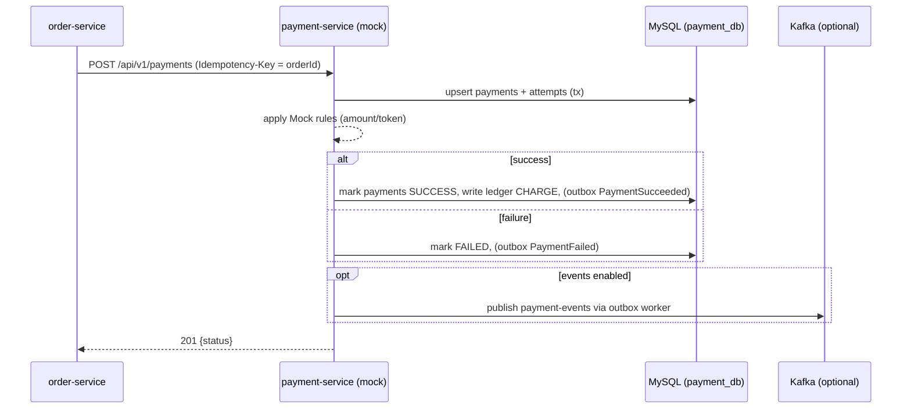

# 1 Add a Optimistic Lock (@Version) in inventory database to avoid inconsisitency when multiple users communicate with the inventory database simultaneously.

# 2 Finish Payment Service: Mock-only Plan (Synchronous, No External PSP)

> **Constraint**: No external PSP. Provide a self-contained payment-service with deterministic mock rules, strong idempotency, durable state, optional events, and simple refunds. Integrates with my current **order-service** via **synchronous** REST (no consumers required).

---

## 0) Goals

**Goals**

* `POST /payments` returns **SUCCESS/FAILED** deterministically (mock rules) and is **idempotent**.
* Persist a **payments ledger** for audit and refunds (durable state).
* (Optional) publish `payment-events` to Kafka for future consumers.
* Keep order-service flow: **CREATED → (pay) → PAID / CANCELLED → COMPLETED**.

---

## 1) Architecture (Mock‑only, Synchronous)



---

## 2) Data Model (MySQL)

Use **Flyway** to manage schema. URL with `createDatabaseIfNotExist=true` auto-creates `payment_db` on first run.

```sql
-- V1__init.sql
CREATE TABLE IF NOT EXISTS payments (
  payment_id      CHAR(36) PRIMARY KEY,
  order_id        CHAR(36) NOT NULL UNIQUE,
  user_id         VARCHAR(100) NOT NULL,
  amount_cents    BIGINT NOT NULL,
  currency        VARCHAR(3) NOT NULL DEFAULT 'USD',
  status          VARCHAR(24) NOT NULL,  -- PENDING|SUCCESS|FAILED|REFUNDED|PARTIALLY_REFUNDED
  psp             VARCHAR(24) NOT NULL DEFAULT 'mock',
  psp_payment_id  VARCHAR(64),
  failure_code    VARCHAR(64),
  failure_message VARCHAR(255),
  created_at      TIMESTAMP NOT NULL DEFAULT CURRENT_TIMESTAMP,
  updated_at      TIMESTAMP NOT NULL DEFAULT CURRENT_TIMESTAMP ON UPDATE CURRENT_TIMESTAMP
);

CREATE TABLE IF NOT EXISTS payment_attempts (
  attempt_id      CHAR(36) PRIMARY KEY,
  payment_id      CHAR(36) NOT NULL,
  idempotency_key VARCHAR(128) NOT NULL,
  status          VARCHAR(16) NOT NULL,   -- PENDING|SUCCESS|FAILED
  psp_attempt_id  VARCHAR(64),
  failure_code    VARCHAR(64),
  failure_message VARCHAR(255),
  created_at      TIMESTAMP NOT NULL DEFAULT CURRENT_TIMESTAMP,
  UNIQUE KEY ux_attempt_idem (idempotency_key),
  CONSTRAINT fk_attempt_payment FOREIGN KEY (payment_id) REFERENCES payments(payment_id)
);

CREATE TABLE IF NOT EXISTS payment_ledger (
  ledger_id       CHAR(36) PRIMARY KEY,
  payment_id      CHAR(36) NOT NULL,
  type            VARCHAR(16) NOT NULL,   -- CHARGE|REFUND
  amount_cents    BIGINT NOT NULL,
  created_at      TIMESTAMP NOT NULL DEFAULT CURRENT_TIMESTAMP,
  CONSTRAINT fk_ledger_payment FOREIGN KEY (payment_id) REFERENCES payments(payment_id)
);

-- Optional outbox for reliable events
CREATE TABLE IF NOT EXISTS outbox_events (
  event_id        CHAR(36) PRIMARY KEY,
  aggregate_type  VARCHAR(24) NOT NULL,  -- 'Payment'
  aggregate_id    CHAR(36) NOT NULL,     -- payment_id
  type            VARCHAR(48) NOT NULL,  -- PaymentSucceeded|PaymentFailed|PaymentRefunded
  payload         JSON NOT NULL,
  created_at      TIMESTAMP NOT NULL DEFAULT CURRENT_TIMESTAMP,
  published       TINYINT(1) NOT NULL DEFAULT 0
);
```

---

## 3) REST API (internal, JWT‑protected)

**Base**: `/api/v1`

### 3.1 Charge (idempotent)

```
POST /api/v1/payments
Authorization: Bearer <service JWT>
Idempotency-Key: <orderId or uuid>
{
  "orderId": "<uuid>",
  "userId": "<string>",
  "amount": 1299.00,
  "currency": "USD",
  "sourceToken": "tok_xxx"  // opaque; used by mock rules
}
```

Responses: `201 {paymentId,status,pspPaymentId}` | `409` (amount mismatch) | `422` (validation)

### 3.2 Query

```
GET /api/v1/payments/{paymentId}
```

### 3.3 Refund (idempotent)

```
POST /api/v1/payments/{paymentId}/refunds
Authorization: Bearer <service JWT>
Idempotency-Key: <uuid>
{ "amount": 500.00 }   // omit for full refund
```

Responses: `201 {status: REFUNDED|PARTIALLY_REFUNDED}` | `409` (exceeds balance)

**Idempotency policy**: Same `Idempotency-Key` **must** return the same result; enforced by `payment_attempts.idempotency_key` UNIQUE + service code.

---
